# LLM Fine-Tuning: Invoice Data Extraction

Fine-tuned **Mistral 7B** on invoice field extraction using **QLoRA** (4-bit quantization + LoRA adapters), benchmarked against **GPT-4o-mini** baseline. Achieved **+77.8% improvement** in overall field extraction accuracy on a 296-sample eval set.

## Results (296-sample evaluation)

| Metric | Fine-Tuned Mistral 7B | GPT-4o-mini Baseline | Improvement |
|--------|----------------------|---------------------|-------------|
| Overall Accuracy | 86.4% | 48.6% | +77.8% |
| JSON Parse Rate | 97.3% | 58.8% | +65.5% |
| Line Item Score | 86.0% | 99.5% | -13.6% |

### Per-Field Accuracy

| Field | Fine-Tuned | GPT-4o-mini | Improvement |
|-------|-----------|-------------|-------------|
| due_date | 96.2% | 33.9% | +183.7% |
| invoice_date | 90.6% | 32.2% | +181.6% |
| discount | 97.9% | 98.9% | -0.9% |
| tax_amount | 96.9% | 100.0% | -3.1% |
| currency | 96.5% | 77.6% | +24.4% |
| total_amount | 95.1% | 100.0% | -4.9% |
| vendor_name | 86.1% | 100.0% | -13.9% |
| payment_terms | 80.2% | 85.1% | -5.7% |
| invoice_number | 78.5% | 100.0% | -21.5% |
| billing_address | 73.3% | 82.8% | -11.5% |

**Key takeaways:**
- **+77.8% overall accuracy** — fine-tuned model significantly outperforms zero-shot GPT-4o-mini
- **97.3% JSON parse rate** vs GPT-4o-mini's 58.8% — nearly every output is valid, structured JSON
- **Biggest gains on dates:** +183.7% on due_date, +181.6% on invoice_date — the model learned the exact YYYY-MM-DD format from training
- **+24.4% on currency** — model correctly identifies currency from context
- GPT-4o-mini is stronger on some fields (vendor_name, invoice_number) when it successfully parses, but its 58.8% parse rate means 41% of outputs are unusable

## Training Details

- **Base model:** [mistralai/Mistral-7B-v0.3](https://huggingface.co/mistralai/Mistral-7B-v0.3) (7.4B parameters)
- **Method:** QLoRA — 4-bit NF4 quantization via bitsandbytes, LoRA adapters via PEFT
- **LoRA config:** rank=64, alpha=128, targeting all attention + MLP layers (q/k/v/o_proj, gate/up/down_proj)
- **Trainable params:** 167M / 7.4B (2.26%)
- **Training precision:** bf16 (bfloat16 — matches Mistral's native dtype, avoids GradScaler issues)
- **Optimizer:** paged AdamW 8-bit
- **Learning rate:** 1e-4 with cosine schedule
- **Batch size:** 2 × 8 gradient accumulation = effective 16
- **Max sequence length:** 768 tokens (99th percentile of data at 689 tokens)
- **Best checkpoint:** Step 30, eval_loss=0.5480, mean_token_accuracy=87.0%
- **Compute:** Kaggle T4 GPU (15GB VRAM)
- **Experiment tracking:** [W&B Dashboard](https://wandb.ai/pushparajmehta002-rk-university/invoice-extraction-finetune)

### Training Curves (Steps 0-120, before collapse)

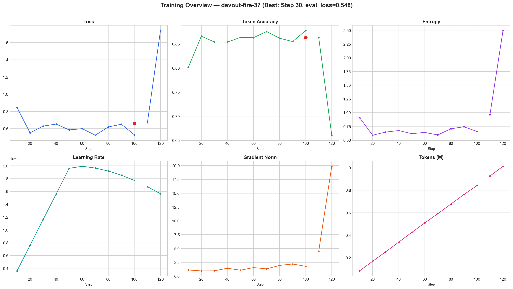

<details>
<summary>Training Metrics</summary>

**Training & Evaluation Loss**
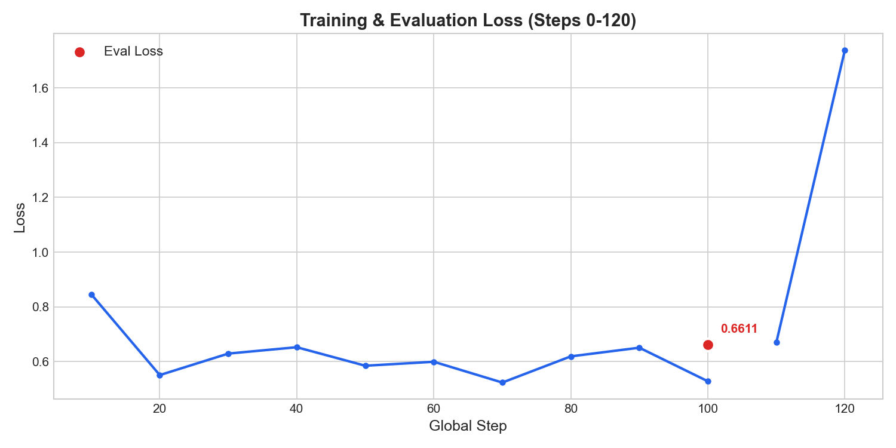

**Mean Token Accuracy**
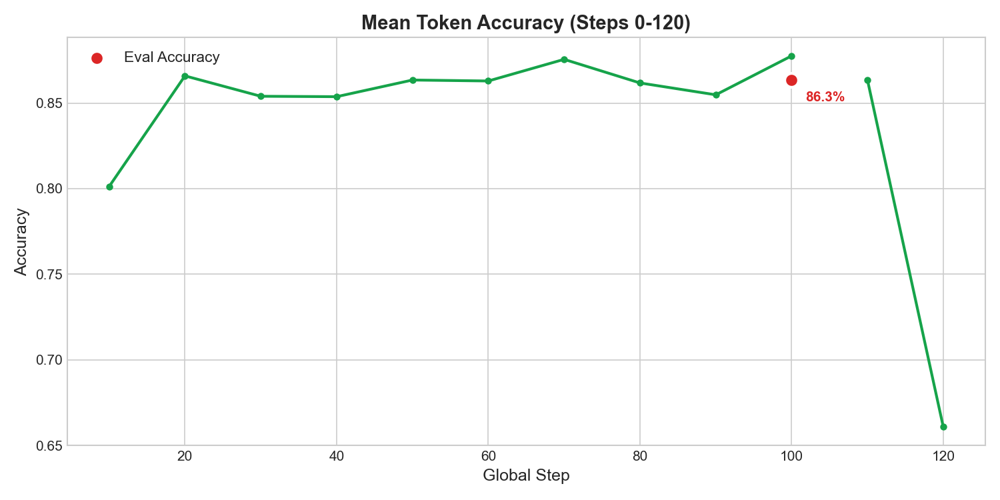

**Training & Evaluation Entropy**
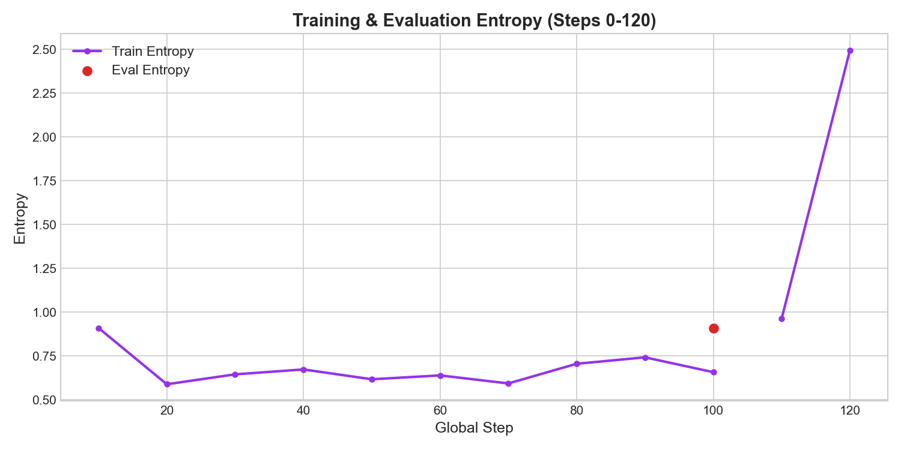

**Learning Rate Schedule (Cosine)**
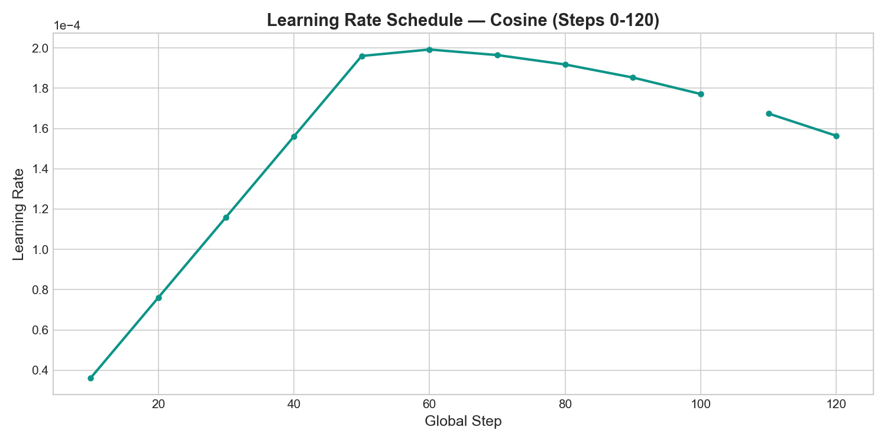

**Gradient Norm**
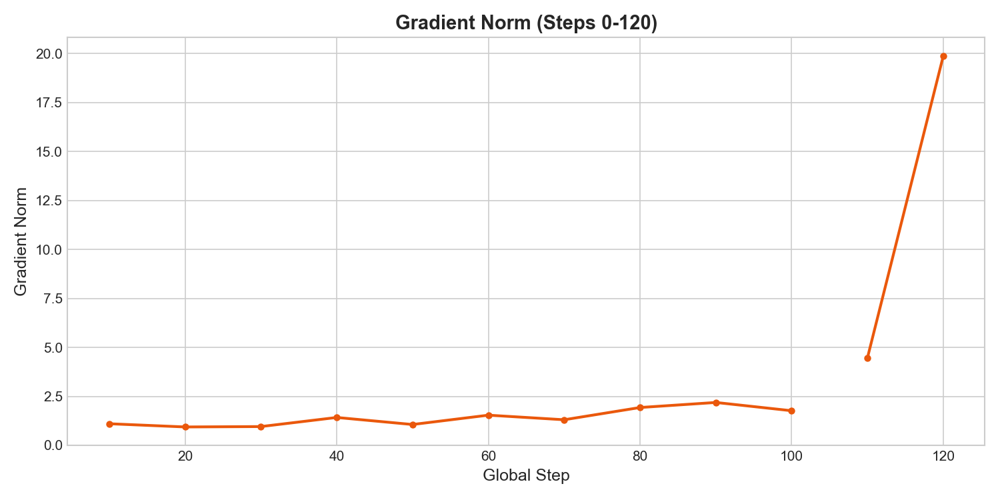

**Epoch Progress**
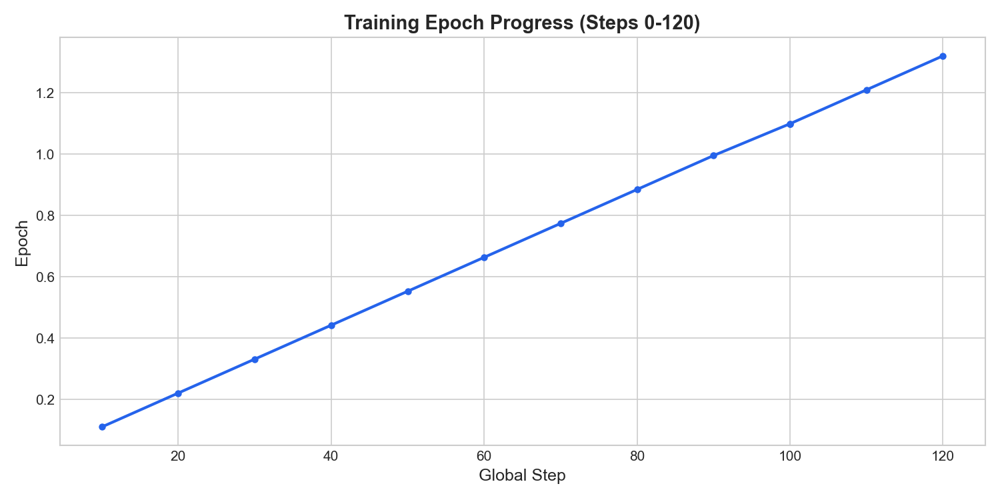

**Tokens Processed**
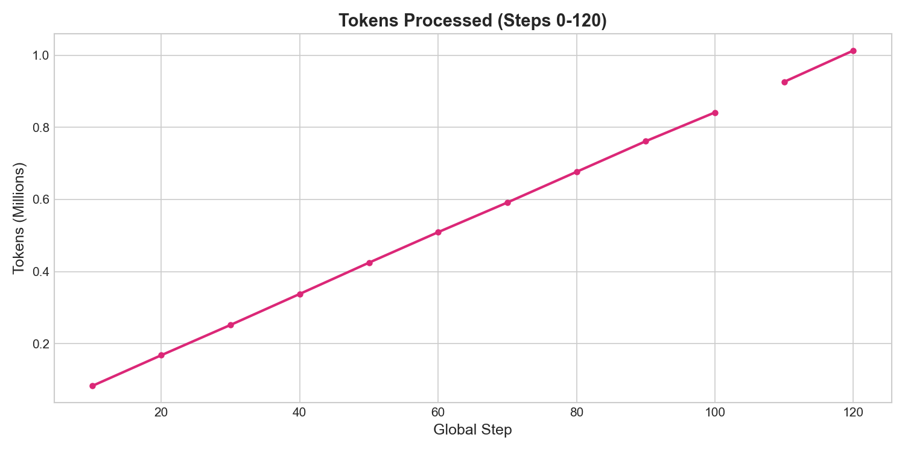

</details>

<details>
<summary>System Metrics (Kaggle T4 x2)</summary>

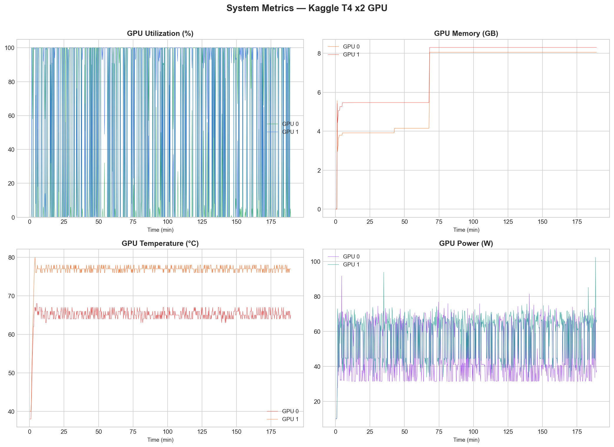

**GPU Utilization**
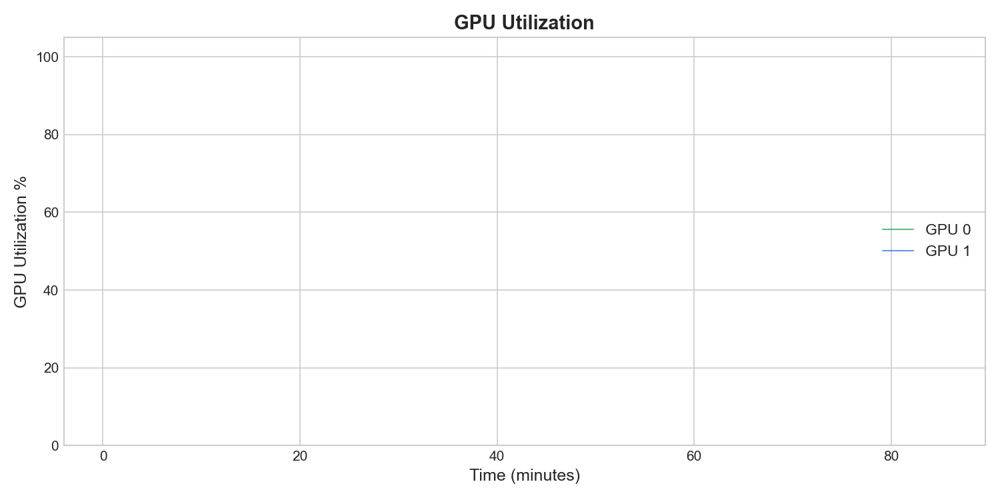

**GPU Memory Allocation**
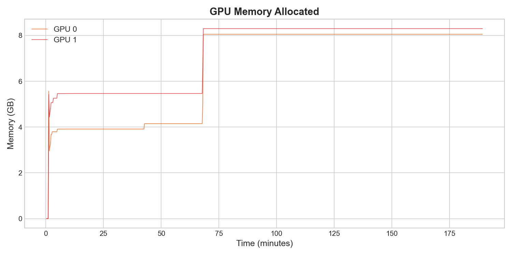

**GPU Temperature**
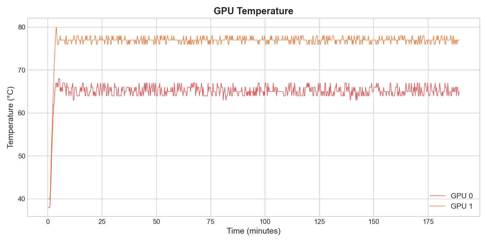

**GPU Power Consumption**
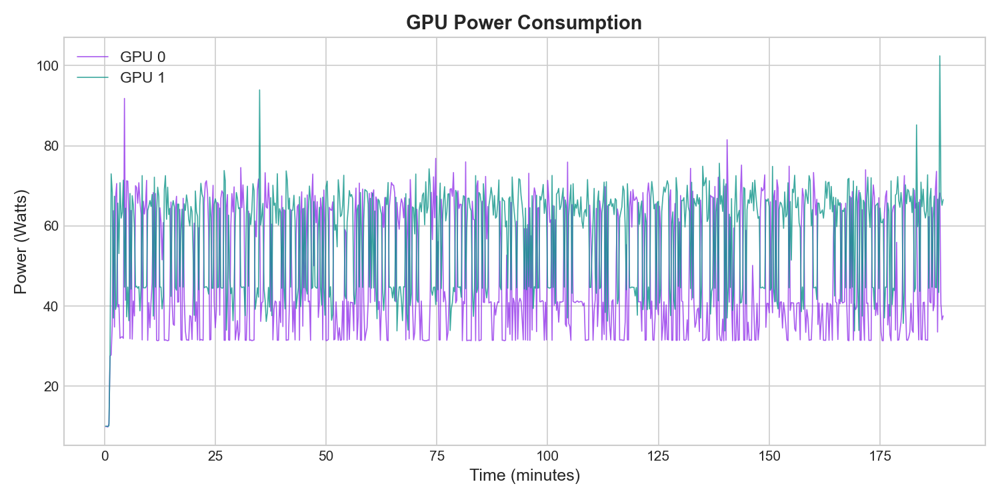

**CPU & System Memory**
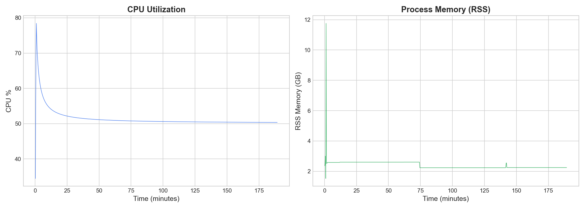

**Network I/O**
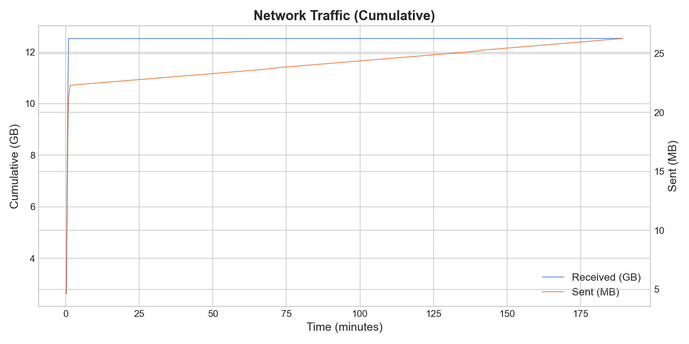

**Disk I/O**
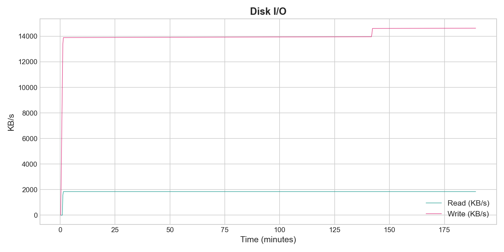

</details>

## Dataset

Built from three sources:

| Source | Samples | Description |
|--------|---------|-------------|
| HuggingFace OCR (pre-labeled) | 409 | Real invoice scans from [mychen76/invoices-and-receipts_ocr_v1](https://huggingface.co/datasets/mychen76/invoices-and-receipts_ocr_v1) with existing structured labels |
| HuggingFace OCR (LLM-labeled) | 1,566 | Same dataset — real OCR text but no labels. Used GPT-4o-mini to extract structured fields |
| Synthetic | ~1,000 | Generated diverse invoices via GPT-4o-mini with varied currencies, date formats, line items |

**Final split:** 1,445 train / 296 eval

**Data cleaning:** Standardized 6 date formats to YYYY-MM-DD, removed 52 samples with math inconsistencies (line items didn't add up to total), fixed European number formats ($7,50 → 7.50).

## Invoice Schema

```json
{
  "vendor_name": "string",
  "invoice_number": "string",
  "invoice_date": "YYYY-MM-DD",
  "due_date": "YYYY-MM-DD",
  "total_amount": 0.0,
  "currency": "USD",
  "tax_amount": 0.0,
  "discount": 0.0,
  "billing_address": "string",
  "payment_terms": "string",
  "line_items": [
    {
      "description": "string",
      "quantity": 0.0,
      "unit_price": 0.0,
      "line_total": 0.0
    }
  ]
}
```

## Project Structure

```
src/
├── data/              # Schema, data loading, synthetic gen, LLM labeling, merge, format
├── training/          # QLoRA config, model setup, training loop (bf16, SFTTrainer)
└── evaluation/        # Metrics (exact + fuzzy match), baseline runner, report generator
notebooks/
├── 01_data_preparation.ipynb    # EDA, load HF dataset, LLM labeling, synthetic gen, merge
├── 02_data_cleaning.ipynb       # Visualizations, date standardization, math validation
├── 03_training.ipynb            # QLoRA training on Kaggle T4
└── 04_evaluation.ipynb          # Fine-tuned vs GPT-4o-mini comparison
tests/                 # 45 unit tests
configs/default.json   # Training hyperparameters
```

## Setup

```bash
git clone https://github.com/Pushparaj13811/invoice-extraction-mistral-7b-fine-tuning.git
cd invoice-extraction-mistral-7b-fine-tuning
pip install -r requirements.txt
cp .env.example .env   # Fill in Azure OpenAI + HuggingFace + W&B keys
```

## Usage

### 1. Prepare Data
Run `notebooks/01_data_preparation.ipynb` — explores HF dataset, loads pre-labeled records, labels unlabeled OCR records with GPT-4o-mini, generates synthetic data, merges and saves as JSONL.

### 2. Clean Data
Run `notebooks/02_data_cleaning.ipynb` — EDA with visualizations, standardizes dates, removes math-inconsistent samples.

### 3. Train (requires GPU)
Run `notebooks/03_training.ipynb` on Kaggle T4 or Google Colab T4. Training uses bf16 precision with frequent checkpointing (save_steps=30).

### 4. Evaluate
Run `notebooks/04_evaluation.ipynb` — loads fine-tuned model + adapter, runs batched inference, compares against GPT-4o-mini baseline, generates per-field accuracy report.

## Evaluation Metrics

- **Exact match** for: invoice_number, invoice_date, due_date, total_amount, currency, tax_amount, discount, payment_terms
- **Fuzzy match** (Levenshtein ratio > 0.85 via rapidfuzz) for: vendor_name, billing_address, line item descriptions
- **Line items:** Matched by description similarity, then compared quantity/unit_price/line_total per matched item

## Tech Stack

| Component | Technology |
|-----------|------------|
| Base Model | Mistral 7B v0.3 |
| Fine-tuning | QLoRA (4-bit NF4 + LoRA rank 64) |
| Training | HuggingFace TRL SFTTrainer |
| Quantization | bitsandbytes |
| Adapters | PEFT (LoRA) |
| Tracking | Weights & Biases |
| Baseline | GPT-4o-mini via Azure OpenAI |
| Evaluation | rapidfuzz (fuzzy matching) |
| Schema | Pydantic |
| Compute | Kaggle T4 GPU (free tier) |
